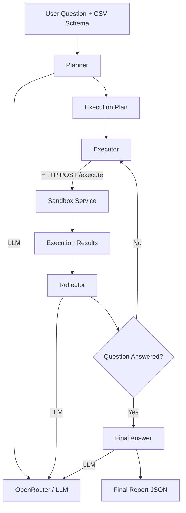

# AI Data Scientist Agent

The agent is the core intelligence of the system. It receives a dataset schema and a natural-language question, then autonomously **plans**, **executes code**, **reviews results**, and **synthesizes a final answer**. It is built as a stateful graph using **LangGraph** and runs inside a Celery worker.

---

# High-Level Architecture



The agent loops until the **Reflector** determines that the user's question has been fully answered or the maximum number of planning iterations has been reached.

---

# State

The agent carries a typed `AgentState` object throughout the graph.

| Field | Description |
|-------|-------------|
| `user_question` | Natural language question from the user |
| `dataframe_info` | Column names, dtypes, and sample rows (never the full dataset) |
| `file_path` | Path to the uploaded CSV file inside the container |
| `plan` | List of `CodeAction` objects to execute |
| `execution_results` | Outputs collected from each execution step |
| `iteration_count` | Number of completed planning iterations |
| `max_iterations` | Maximum planning loops (default: 3) |
| `is_complete` | Indicates whether the reflector considers the task finished |
| `final_answer` | Final synthesized report containing summaries, statistics, figures, and tables |

---

# Nodes

## 1. Planner

**Input**

- `dataframe_info`
- `user_question`
- `file_path`

**Output**

- `plan` (list of `CodeAction` objects)

The planner constructs prompts from `planner_system.txt` and `planner_user.txt`, then queries the LLM to generate a structured JSON execution plan.

Each action contains:

- `action_type`: `"execute_code"`
- `code`: Valid Python code
- `description`: Human-readable explanation of the step

The output is validated against a Pydantic `PlanSchema`.

If the LLM fails to generate valid JSON after retries, the planner falls back to a safe default plan that reports the failure.

---

## 2. Executor

**Input**

- `plan`

**Output**

- `execution_results`

For every `execute_code` action, the executor sends Python code to the **Sandbox Service** using:

```http
POST /execute
```

The executor retries transient failures (connection errors or HTTP 5xx responses) up to **two times**.

Each sandbox execution returns:

- `stdout`
- `stderr`
- `error`
- `images` (base64-encoded PNG files)

These results are accumulated into `execution_results` and forwarded to the reflector.

---

## 3. Reflector

**Input**

- `execution_results`
- `plan`
- `user_question`

**Output**

- `is_complete`
- Optional revised `plan`

The reflector evaluates the completed execution history and determines whether the original question has been answered.

Possible outputs:

```json
{
  "is_complete": true
}
```

or

```json
{
  "is_complete": false,
  "revised_plan": [...]
}
```

If additional work is required, the execution history is cleared and the new plan is executed.

When `max_iterations` is reached, the reflector forces completion to prevent infinite loops.

---

## 4. Final Answer

**Input**

- Complete execution history

**Output**

- `final_answer`

The final node asks the LLM to synthesize a coherent report containing:

- `summary`
- `statistics`
- `figures`
- `tables`

The resulting JSON is stored in the database and returned through the API.

---

# External Dependencies

## LLM (via OpenRouter)

All intelligent nodes use the shared `call_llm()` function.

Features include:

- OpenAI-compatible API (OpenRouter or any compatible provider)
- Automatic retries using **Tenacity**
- Pydantic validation
- Optional **Langfuse** tracing

---

## Sandbox Service

The sandbox is deployed as a separate Docker container exposing:

```http
POST /execute
```

Responsibilities include:

- Executing Python code safely
- Restricting available modules to an approved whitelist
- Capturing stdout and stderr
- Collecting generated PNG figures
- Reading uploaded CSV files from a shared read-only volume

---

# Safety & Error Handling

The system includes several safety mechanisms.

### Sandbox Isolation

LLM-generated Python never executes directly on the host.

Instead it runs inside an isolated container configured with:

- read-only filesystem
- temporary in-memory filesystem (`tmpfs`)
- restricted module whitelist

### Timeouts

- Agent timeout (default: **300 seconds**)
- Sandbox timeout (**15 seconds** per execution step)

### Fallbacks

If either the planner or reflector repeatedly fails, the agent switches to predefined safe fallback behavior instead of hanging indefinitely.

### Loop Protection

`max_iterations` guarantees that the agent eventually terminates, even if the reflector continuously requests additional execution.

---

# Configuration

| Variable | Default | Description |
|----------|---------|-------------|
| `AGENT_TIMEOUT` | `300` | Maximum total execution time (seconds) |
| `MAX_ITERATIONS` | `3` | Maximum planning iterations |
| `MAX_SANDBOX_RETRIES` | `2` | HTTP retries for sandbox requests |
| `SANDBOX_URL` | `http://sandbox:8001` | Sandbox service endpoint |
| `OPENROUTER_API_KEY` | — | API key for the language model |
| `LANGFUSE_PUBLIC_KEY` | — | Optional Langfuse tracing |

---

# Future Enhancements

- Multi-turn conversations for iterative data analysis.
- Additional tools such as SQL engines and Topological Data Analysis (TDA).
- Prompt A/B testing and evaluation.
- Real-time streaming of planning, execution, and reflection progress to the frontend.
- Support for multiple LLM providers and local inference backends.

---

# Summary

The AI Data Scientist Agent combines **LangGraph**, **OpenRouter**, and a secure **Sandbox Service** to build an autonomous analysis workflow capable of planning, executing Python code, evaluating intermediate results, and producing explainable analytical reports. Its graph-based architecture, strong validation, sandbox isolation, and iterative reasoning make it reliable, extensible, and production-ready.
