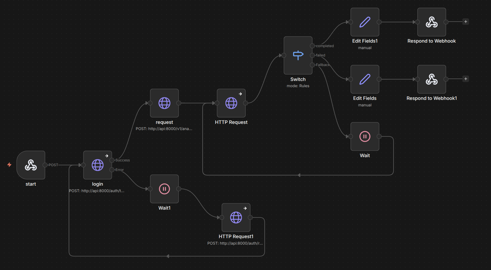

# n8n UI (Low-Code Frontend)

The Data Scientist Agent includes a ready-to-use user interface built with **n8n**, a self-hosted workflow automation platform. It provides:

- Web-based forms for **user registration and login**.
- A **file upload interface** for submitting CSV files and analysis questions.
- Automatic **polling for analysis results** and display of the AI-generated response.

## 🚀 Getting Started

1. Start the full application stack:

   ```bash
   docker compose up -d
   ```

2. Open **n8n** at:

   ```
   http://localhost:5678
   ```

3. Create an account. The **first registered user** automatically becomes the workspace owner.

4. Import the provided workflows:

   - Navigate to **Workflows → Import from File**.
   - Import each `.json` file from:

     ```
     deployments/n8n/workflows/
     ```

5. Activate each workflow by enabling the **Active** toggle.

6. *(Optional)* If a workflow contains a **Webhook** node, activating it will generate a production webhook URL that can be used by external applications or tests.

---

## 🎛️ Available Workflows

| Workflow | Purpose |
|----------|---------|
| `register.json` | Register a new user |
| `login.json` | Authenticate a user and return a JWT access token |
| `submit-analysis.json` | Upload a CSV file and submit an analysis request (requires authentication) |
| `poll-results.json` | Poll the analysis job until the final result is available |
| `full-analysis.json` | Complete end-to-end workflow: register/login, submit a dataset, poll for completion, and display the final answer |

---

## 🌐 Creating a Public Form

The `full-analysis.json` workflow uses a **Webhook** trigger by default. To expose it as a user-friendly web form:

1. Open the workflow.
2. Delete the existing **Webhook** node.
3. Add a **Form** node.
4. Configure the following fields:

   - **email** (Text)
   - **password** (Text)
   - **question** (Text)
   - **file** (File)

5. Connect the **Form** node to the remainder of the workflow.
6. Activate the workflow.
7. Share the generated public form URL.

Users can now access a clean web interface from their browser to upload a dataset, submit a question, and receive the AI-generated analysis.

---

## 💡 Notes

- All workflows assume that the backend API is already running.
- Authentication-protected workflows require a valid JWT obtained from `login.json`.
- The polling workflow periodically checks the analysis status until the job is complete.
- You can further customize the form by adding validation, branding, or additional input fields directly within n8n.

## 📸 Screenshots

### Full Analysis Workflow

<p align="center">
  
</p>
