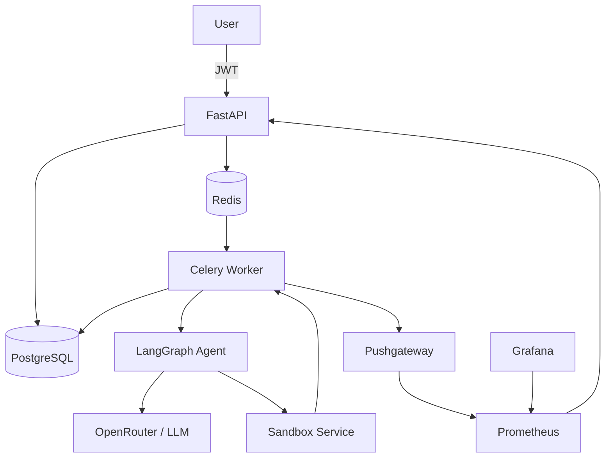

# 🤖 Data Scientist Agent

[](https://github.com/Ma-Sheikhani/data-scientist-agent/actions/workflows/ci.yml)
[](https://www.python.org/)
[](https://fastapi.tiangolo.com/)
[](https://www.docker.com/)
[](LICENSE)

> **An industrial-grade AI Data Scientist that autonomously plans analyses, generates Python code, executes it securely inside a sandbox, reflects on the results, and produces explainable reports from CSV datasets.**

Built with **FastAPI**, **LangGraph**, **Celery**, **PostgreSQL**, **Redis**, **Prometheus**, **Grafana**, **n8n**, and **Docker** using production-ready software engineering practices.

---

# ✨ Features

- 🤖 **Autonomous AI Agent** powered by LangGraph (plan → execute → reflect → answer)
- 📊 Upload any CSV dataset and ask questions in natural language
- 🐍 LLM-generated Python executed inside a secure sandbox
- 🔄 Iterative reasoning with a self-reflection loop
- ⚡ Asynchronous processing with Celery workers
- 🔐 JWT authentication with configurable rate limiting
- 🔍 Optional PII redaction using Microsoft Presidio
- 📈 Full observability with Prometheus, Grafana, Flower, and Langfuse
- 🛡️ Input validation (MIME type, file size, and request validation)
- 🐘 PostgreSQL with SQLAlchemy Async
- 📦 Dockerized microservice architecture
- 🧪 Comprehensive testing (unit, integration, and load testing)
- 🎛️ **Optional n8n low-code UI** with ready-to-use workflows
- 🚀 Production-oriented project structure

---

# 🏗️ Architecture



## Request Flow

1. The client uploads a CSV file together with a natural-language question.
2. **FastAPI** validates the request, optionally redacts PII, stores job metadata in PostgreSQL, and enqueues a Celery task.
3. **Redis** delivers the task to a Celery worker.
4. The worker invokes the **LangGraph** agent.
5. The agent:
   - Plans the analysis.
   - Generates Python code.
   - Executes the code inside the sandbox.
   - Evaluates the results.
   - Repeats the process if necessary.
   - Synthesizes the final report.
6. The completed report is stored in PostgreSQL and returned through the API.
7. **Prometheus** collects metrics from the API and workers, while **Grafana** visualizes dashboards.

---

# 🛠️ Tech Stack

| Category | Technologies |
|----------|--------------|
| **API** | FastAPI, Pydantic v2 |
| **Database** | PostgreSQL, SQLAlchemy 2.0 (Async), Alembic |
| **Queue** | Celery, Redis |
| **AI Agent** | LangGraph |
| **LLM** | OpenRouter (or any OpenAI-compatible provider), Ollama, vLLM |
| **Sandbox** | FastAPI-based isolated Docker container |
| **Authentication** | JWT, bcrypt |
| **Security** | SlowAPI (rate limiting), Microsoft Presidio (PII redaction), request validation |
| **Monitoring** | Prometheus, Pushgateway, Grafana, Loguru |
| **Observability** | Langfuse, Flower |
| **UI (Low-Code)** | n8n (self-hosted workflow automation) |
| **Containerization** | Docker, Docker Compose |
| **Testing** | Pytest, pytest-asyncio, Testcontainers |
| **Code Quality** | Black, isort, Flake8, mypy, Bandit |

---

# 🚀 Quick Start

## Prerequisites

- Python 3.11+
- Docker
- Docker Compose

## Clone the Repository

```bash
git clone https://github.com/Ma-Sheikhani/data-scientist-agent.git
cd data-scientist-agent
```

## Configure Environment Variables

Copy the example environment file:

```bash
cp .env.example .env
```

Required variables:

```env
OPENROUTER_API_KEY=your_api_key
```

Optional variables:

```env
LANGFUSE_PUBLIC_KEY=
LANGFUSE_SECRET_KEY=
```

## Start the Application

```bash
docker compose up --build
```

This starts the complete application stack:

- FastAPI
- PostgreSQL
- Redis
- Celery Worker
- Sandbox Service
- Prometheus
- Pushgateway
- Grafana
- n8n

---

## Available Services

| Service | URL |
|---------|-----|
| API Documentation | http://localhost:8000/docs |
| Grafana | http://localhost:3000 |
| Prometheus | http://localhost:9090 |
| Flower *(optional)* | http://localhost:5555 |
| n8n | http://localhost:5678 |

### Default Grafana Credentials

```text
Username: admin
Password: admin
```

> **Note:** The first person to open the n8n web interface becomes the workspace owner. You can optionally enable basic authentication by configuring the `N8N_BASIC_AUTH_*` environment variables in `docker-compose.yml`.

---

# 📖 Usage

## 🔧 Programmatic API (cURL / HTTP)

### Register

```bash
curl -X POST http://localhost:8000/auth/register \
  -H "Content-Type: application/json" \
  -d '{"email":"demo@example.com","password":"strongpassword"}'
```

### Login

```bash
curl -X POST http://localhost:8000/auth/token \
  -H "Content-Type: application/json" \
  -d '{"email":"demo@example.com","password":"strongpassword"}'
```

Save the returned JWT access token.

### Submit an Analysis

```bash
curl -X POST http://localhost:8000/v1/analyze \
  -H "Authorization: Bearer <TOKEN>" \
  -F "file=@iris.csv" \
  -F "question=What is the average sepal length by species? Create a bar chart."
```

### Poll for Results

```bash
curl http://localhost:8000/v1/analyze/<JOB_ID>/status \
  -H "Authorization: Bearer <TOKEN>"
```

Once the job completes, the response includes:

- Summary
- Statistics
- Figures
- Tables

---

# 🎛️ Using the n8n UI (No-Code)

If you prefer a point-and-click interface, the project includes a self-hosted **n8n** instance with ready-to-use workflows.

## Import the Workflows

1. Open **http://localhost:5678** and create an account (the first user becomes the workspace owner).
2. Navigate to **Workflows → Import from File**.
3. Import each workflow from:

```text
deployments/n8n/workflows/
```

Available workflows include:

- `full-analysis.json` — Complete workflow for registration, authentication, dataset upload, analysis submission, polling, and result display.
- Individual workflows for:
  - User registration
  - User login
  - Analysis submission
  - Result polling

4. Activate each workflow by enabling the **Active** toggle.

## Use the "Full Analysis" Workflow

The `full-analysis.json` workflow can be used in two different modes.

### Webhook Mode

Send a `POST` request using `multipart/form-data` containing:

- Email
- Password
- CSV file
- Analysis question

### Form Mode (Recommended)

Replace the **Webhook** trigger with a **Form** node.

Configure the following fields:

- Email
- Password
- Question
- File Upload

Activate the workflow and share the generated public URL.

Users can then open the form directly in their browser, upload a dataset, ask a question, and receive an AI-generated analysis without writing any code.

For more details, see the [n8n UI Guide](docs/N8N.md).

---

# 📁 Project Structure

```text
data-scientist-agent/
├── api/                     # FastAPI application
├── agent/                   # LangGraph agent
├── workers/                 # Celery workers
├── sandbox/                 # Secure Python execution service
├── deployments/
│   ├── docker-compose/      # Docker Compose configuration
│   ├── helm/                # Helm chart (work in progress)
│   └── n8n/
│       └── workflows/       # Exported n8n workflow JSON files
├── docs/                    # Project documentation
├── tests/                   # Unit, integration, security, and load tests
├── .github/
│   └── workflows/           # GitHub Actions CI
├── Dockerfile
├── docker-compose.yml
├── pyproject.toml
└── README.md
```

---

# 📚 Documentation

| Document | Description |
|----------|-------------|
| [ARCHITECTURE.md](docs/ARCHITECTURE.md) | Overall system architecture |
| [AGENT.md](docs/AGENT.md) | LangGraph agent internals |
| [API.md](docs/API.md) | REST API documentation |
| [DEPLOYMENT.md](docs/DEPLOYMENT.md) | Deployment guide |
| [N8N.md](docs/N8N.md) | n8n setup, workflows, and demo guide |
| [OPERATIONS.md](docs/OPERATIONS.md) | Monitoring and troubleshooting |
| [PERFORMANCE.md](docs/PERFORMANCE.md) | Performance and load testing |
| [SECURITY.md](docs/SECURITY.md) | Security architecture |

---

# 🧪 Testing

Run the complete test suite:

```bash
docker compose exec api poetry run pytest
```

Run the tests with coverage:

```bash
docker compose exec api poetry run pytest \
    --cov=api \
    --cov=agent \
    --cov=workers \
    --cov-report=term-missing \
    --cov-fail-under=70
```

The project includes:

- ✅ Unit tests
- ✅ Integration tests
- ✅ Load tests
- ✅ Static type checking with **mypy**
- ✅ Security scanning with **Bandit**

---

# 🔒 Security

The project incorporates multiple layers of security:

- JWT-based authentication
- bcrypt password hashing
- Configurable API rate limiting
- Optional Microsoft Presidio PII redaction
- Request validation
- File type and size validation
- Sandboxed execution inside an isolated Docker container
- Read-only execution environment
- Restricted Python module whitelist
- Execution timeouts
- Environment-based secrets management

---

# 📊 Monitoring & Observability

The application exports **Prometheus** metrics for both the API and Celery workers.

### Grafana Dashboards

Included dashboards monitor:

- API request rate
- Request latency (P50 / P95 / P99)
- Error rate
- Job completion rate
- Job duration
- Sandbox execution failures
- Celery worker health

### Example Alerting Rules

Typical alert rules include:

- High API error rate
- High job failure rate
- Worker heartbeat loss
- Elevated sandbox failure rate

Additional observability tools include:

- **Langfuse** for LLM tracing and evaluation
- **Flower** for Celery task monitoring

---

# 📄 License

This project is licensed under the **MIT License**.

See the [LICENSE](LICENSE) file for details.

---

# 👤 Author

**Mohammad Amin Sheikhani**

📧 **mash473@gmail.com**

---

# ⭐ Acknowledgements

This project builds upon several outstanding open-source technologies, including:

- FastAPI
- LangGraph
- Celery
- PostgreSQL
- Redis
- SQLAlchemy
- Docker
- Prometheus
- Grafana
- n8n
- Langfuse
- OpenRouter

---

# 💡 About the Project

**Data Scientist Agent** demonstrates a modern AI engineering architecture by combining:

- Autonomous LLM orchestration
- Secure Python code execution
- Asynchronous microservices
- Production-grade observability
- Low-code automation with n8n
- Scalable Docker-based deployment

The goal is to provide an end-to-end AI system capable of autonomously analyzing datasets, generating insights, creating visualizations, and producing explainable reports using natural-language instructions.
