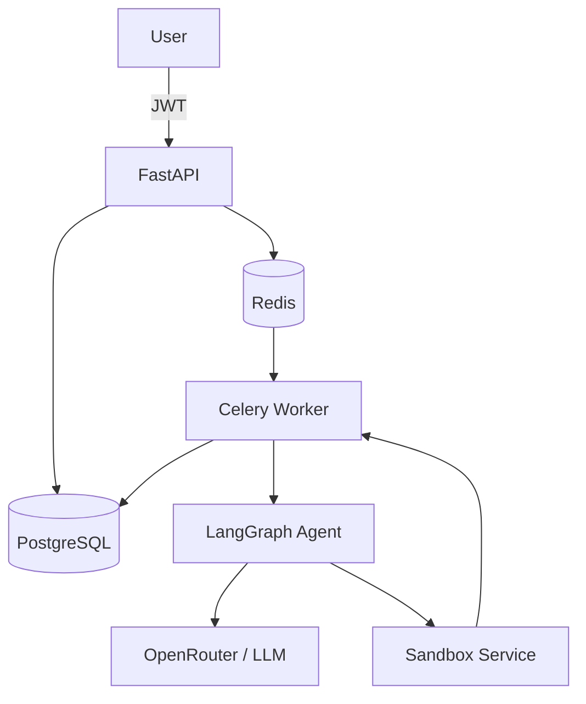

# 🤖 Data Scientist Agent

[](https://github.com/yourusername/data-scientist-agent/actions)
[](https://www.python.org/)
[](https://fastapi.tiangolo.com/)
[](https://www.docker.com/)
[](LICENSE)

> **An industrial-grade AI Data Scientist that autonomously plans analyses, writes Python code, executes it securely inside a sandbox, reflects on the results, and produces explainable reports from CSV datasets.**

Built with **FastAPI**, **LangGraph**, **Celery**, **PostgreSQL**, **Redis**, and **Docker** using production-ready software engineering practices.

---

## ✨ Features

- 🤖 **Autonomous AI Agent** powered by LangGraph
- 📊 Upload any CSV and ask questions in natural language
- 🐍 LLM-generated Python executed inside a secure sandbox
- 🔄 Reflection loop for iterative reasoning and self-correction
- ⚡ Asynchronous processing with Celery workers
- 🔐 JWT authentication
- 🐘 PostgreSQL + SQLAlchemy Async
- 📦 Dockerized microservice architecture
- 🧪 Unit, integration, and load testing
- 📈 Langfuse tracing (optional)
- 🚀 Production-ready project structure

---

# 🏗 Architecture



### Request Flow

1. The client uploads a CSV file and a natural-language question.
2. FastAPI stores job metadata in PostgreSQL.
3. A Celery task is queued through Redis.
4. The Celery worker invokes the LangGraph agent.
5. The agent:
   - plans the analysis,
   - generates Python code,
   - executes it inside the sandbox,
   - evaluates the results,
   - repeats if necessary.
6. The final report is stored and returned through the API.

---

# 🛠 Tech Stack

| Category | Technologies |
|-----------|--------------|
| API | FastAPI, Pydantic v2 |
| Database | PostgreSQL, SQLAlchemy 2.0, Alembic |
| Queue | Celery, Redis |
| AI Agent | LangGraph |
| LLM | OpenRouter (or any OpenAI-compatible API) or local Ollama |
| Sandbox | FastAPI + isolated Docker container |
| Authentication | JWT |
| Containerization | Docker, Docker Compose |
| Testing | Pytest, Pytest-Asyncio, Testcontainers |
| Quality | Black, isort, Ruff/Flake8, mypy, Bandit |
| Observability | Langfuse, Flower, Loguru |

---

# 🚀 Quick Start

## Prerequisites

- Python 3.11+
- Docker
- Docker Compose

---

## Clone the repository

```bash
git clone https://github.com/yourusername/data-scientist-agent.git

cd data-scientist-agent
```

---

## Configure environment variables

```bash
cp .env.example .env
```

Set at least:

```text
OPENROUTER_API_KEY=your_api_key
```

Optional:

```text
LANGFUSE_PUBLIC_KEY=
LANGFUSE_SECRET_KEY=
```

---

## Start the application

```bash
docker compose up --build
```

Services started:

- FastAPI
- PostgreSQL
- Redis
- Celery Worker
- Sandbox Service

API documentation:

```
http://localhost:8000/docs
```

---

# 📖 Usage

## Register

```bash
curl -X POST http://localhost:8000/auth/register \
-H "Content-Type: application/json" \
-d '{"email":"demo@example.com","password":"strongpassword"}'
```

---

## Login

```bash
curl -X POST http://localhost:8000/auth/token \
-H "Content-Type: application/json" \
-d '{"email":"demo@example.com","password":"strongpassword"}'
```

Save the returned JWT token.

---

## Submit an analysis

```bash
curl -X POST http://localhost:8000/v1/analyze \
-H "Authorization: Bearer <TOKEN>" \
-F "file=@iris.csv" \
-F "question=What is the average sepal length by species? Create a bar chart."
```

Response:

```json
{
  "job_id": "xxxxxxxx"
}
```

---

## Poll the job

```bash
curl http://localhost:8000/v1/analyze/<JOB_ID>/status \
-H "Authorization: Bearer <TOKEN>"
```

When completed, the response contains:

- summary
- statistics
- figures
- tables

---

# 📁 Project Structure

```text
data-scientist-agent/
│
├── api/                    # FastAPI application
├── agent/                  # LangGraph agent
├── workers/                # Celery workers
├── sandbox/                # Secure execution service
├── deployments/            # Docker & deployment files
├── docs/                   # Project documentation
├── tests/                  # Unit, integration & load tests
├── .github/workflows/      # CI/CD
│
├── Dockerfile
├── docker-compose.yml
├── pyproject.toml
└── README.md
```

---

# 📚 Documentation

Documentation is available in the **docs/** directory.

| Document | Description |
|----------|-------------|
| `ARCHITECTURE.md` | Overall system architecture |
| `AGENT.md` | LangGraph agent internals |
| `API.md` | REST API reference |
| `DEPLOYMENT.md` | Deployment instructions |
| `PERFORMANCE.md` | Load testing and benchmarks |
| `OPERATIONS.md` | Monitoring and troubleshooting |

---

# 🧪 Testing

Run all tests:

```bash
pytest
```

Run with coverage:

```bash
pytest \
    --cov=api \
    --cov=agent \
    --cov=workers \
    --cov-report=term-missing
```

The project includes:

- Unit tests
- Integration tests
- API tests
- Load tests
- Static type checking
- Security scanning

---

# 🔒 Security

- JWT authentication
- Password hashing
- Secure sandboxed Python execution
- Execution timeouts
- Import whitelist
- Read-only filesystem
- Strict validation with Pydantic
- No hard-coded secrets

---

# 👤 Author

**Mohammad Amin Sheikhani**
- Email: mash473@gmail.com

---

> **Data Scientist Agent** demonstrates modern AI engineering by combining LLM orchestration, secure code execution, asynchronous microservices, and production-grade backend engineering into a single end-to-end system.
