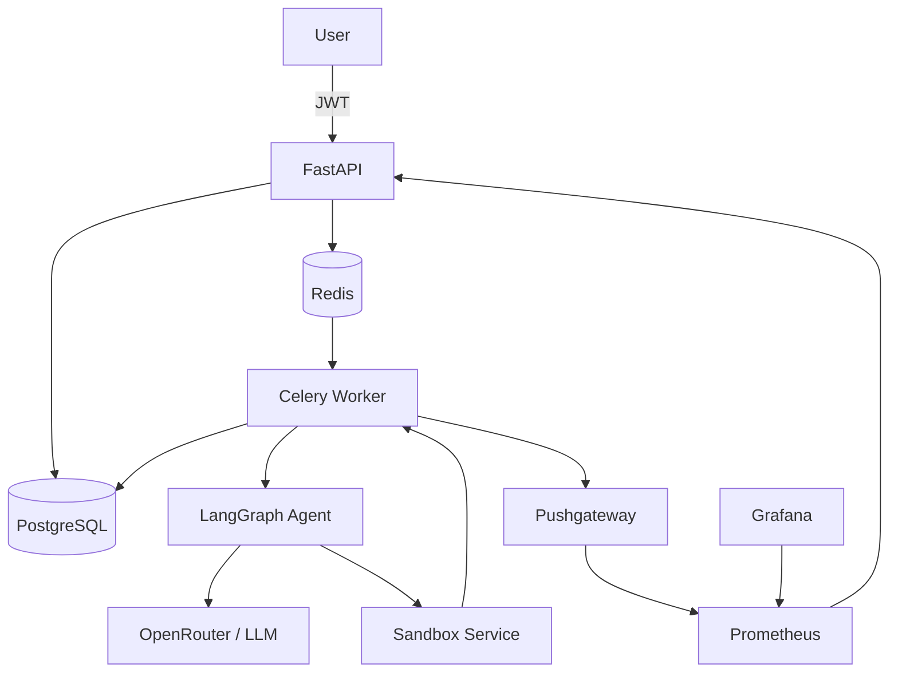

# 🤖 Data Scientist Agent

[](https://github.com/Ma-Sheikhani/data-scientist-agent/actions/workflows/ci.yml)
[](https://www.python.org/)
[](https://fastapi.tiangolo.com/)
[](https://www.docker.com/)
[](LICENSE)

> **An industrial-grade AI Data Scientist that autonomously plans analyses, writes Python code, executes it securely inside a sandbox, reflects on the results, and produces explainable reports from CSV datasets.**

Built with **FastAPI**, **LangGraph**, **Celery**, **PostgreSQL**, **Redis**, **Prometheus**, **Grafana**, and **Docker** using production-ready software engineering practices.

---

# ✨ Features

- 🤖 **Autonomous AI Agent** powered by LangGraph (plan → execute → reflect → answer)
- 📊 Upload any CSV dataset and ask questions in natural language
- 🐍 LLM-generated Python executed inside a secure sandbox
- 🔄 Iterative reasoning with a self-reflection loop
- ⚡ Asynchronous processing with Celery workers
- 🔐 JWT authentication with configurable rate limiting
- 🔍 Optional PII redaction using Microsoft Presidio
- 📈 Full observability with Prometheus, Grafana, Flower, and Langfuse
- 🛡️ Input validation (MIME type, file size, request validation)
- 🐘 PostgreSQL with SQLAlchemy Async
- 📦 Dockerized microservice architecture
- 🧪 Comprehensive testing (unit, integration, and load)
- 🚀 Production-oriented project structure

---

# 🏗 Architecture



## Request Flow

1. The client uploads a CSV file and a natural-language question.
2. FastAPI validates the request, optionally redacts PII, stores job metadata in PostgreSQL, and enqueues a Celery task.
3. Redis delivers the task to a Celery worker.
4. The worker invokes the LangGraph agent.
5. The agent:
   - plans the analysis,
   - generates Python code,
   - executes the code inside the sandbox,
   - evaluates the results,
   - repeats the process if necessary,
   - synthesizes the final report.
6. The completed report is stored in PostgreSQL and returned through the API.
7. Prometheus collects metrics from the API and workers, while Grafana visualizes dashboards.

---

# 🛠 Tech Stack

| Category | Technologies |
|-----------|--------------|
| API | FastAPI, Pydantic v2 |
| Database | PostgreSQL, SQLAlchemy 2.0 (Async), Alembic |
| Queue | Celery, Redis |
| AI Agent | LangGraph |
| LLM | OpenRouter (or any OpenAI-compatible provider), local Ollama or vLLM |
| Sandbox | FastAPI-based isolated Docker container |
| Authentication | JWT, bcrypt |
| Security | SlowAPI (rate limiting), Microsoft Presidio (PII redaction), request validation |
| Monitoring | Prometheus, Pushgateway, Grafana, Loguru |
| Observability | Langfuse, Flower |
| Containerization | Docker, Docker Compose |
| Testing | Pytest, pytest-asyncio, Testcontainers |
| Code Quality | Black, isort, Flake8, mypy, Bandit |

---

# 🚀 Quick Start

## Prerequisites

- Python 3.11+
- Docker
- Docker Compose

## Clone the repository

```bash
git clone https://github.com/yourusername/data-scientist-agent.git

cd data-scientist-agent
```

## Configure environment variables

```bash
cp .env.example .env
```

Required:

```text
OPENROUTER_API_KEY=your_api_key
```

Optional:

```text
LANGFUSE_PUBLIC_KEY=
LANGFUSE_SECRET_KEY=
```

## Start the application

```bash
docker compose up --build
```

The stack starts:

- FastAPI
- PostgreSQL
- Redis
- Celery Worker
- Sandbox Service
- Prometheus
- Pushgateway
- Grafana

### Available services

| Service | URL |
|----------|-----|
| API Documentation | http://localhost:8000/docs |
| Grafana | http://localhost:3000 |
| Prometheus | http://localhost:9090 |
| Flower (optional) | http://localhost:5555 |

Default Grafana credentials:

```text
Username: admin
Password: admin
```

---

# 📖 Usage

## Register

```bash
curl -X POST http://localhost:8000/auth/register \
  -H "Content-Type: application/json" \
  -d '{"email":"demo@example.com","password":"strongpassword"}'
```

## Login

```bash
curl -X POST http://localhost:8000/auth/token \
  -H "Content-Type: application/json" \
  -d '{"email":"demo@example.com","password":"strongpassword"}'
```

Save the returned JWT access token.

## Submit an analysis

```bash
curl -X POST http://localhost:8000/v1/analyze \
  -H "Authorization: Bearer <TOKEN>" \
  -F "file=@iris.csv" \
  -F "question=What is the average sepal length by species? Create a bar chart."
```

Example response:

```json
{
  "job_id": "xxxxxxxx-xxxx-xxxx-xxxx-xxxxxxxxxxxx"
}
```

## Poll for results

```bash
curl http://localhost:8000/v1/analyze/<JOB_ID>/status \
  -H "Authorization: Bearer <TOKEN>"
```

When the job completes, the response contains:

- Summary
- Statistics
- Figures
- Tables

---

# 📁 Project Structure

```text
data-scientist-agent/
├── api/
├── agent/
├── workers/
├── sandbox/
├── deployments/
│   ├── docker-compose/
│   └── helm/
├── docs/
├── tests/
├── .github/workflows/
├── Dockerfile
├── docker-compose.yml
├── pyproject.toml
└── README.md
```

---

# 📚 Documentation

| Document | Description |
|----------|-------------|
| `docs/ARCHITECTURE.md` | Overall system architecture |
| `docs/AGENT.md` | LangGraph agent internals |
| `docs/API.md` | REST API documentation |
| `docs/DEPLOYMENT.md` | Deployment guide |
| `docs/OPERATIONS.md` | Monitoring and troubleshooting |
| `docs/PERFORMANCE.md` | Load testing |
| `docs/SECURITY.md` | Security architecture |

---

# 🧪 Testing

Run all tests:

```bash
docker compose exec api poetry run pytest
```

Run with coverage:

```bash
docker compose exec api poetry run pytest \
    --cov=api \
    --cov=agent \
    --cov=workers \
    --cov-report=term-missing \
    --cov-fail-under=70
```

The project includes:

- Unit tests
- Integration tests
- Load tests
- Static type checking (`mypy`)
- Security scanning (`Bandit`)

---

# 🔒 Security

- JWT authentication
- bcrypt password hashing
- Configurable rate limiting
- Optional Microsoft Presidio PII redaction
- Request validation and file validation
- Sandboxed execution inside an isolated Docker container
- Read-only filesystem
- Restricted Python module whitelist
- Execution timeouts
- Environment-based secrets management

---

# 📊 Monitoring

The application exposes Prometheus metrics for both the API and Celery workers.

Grafana dashboards include:

- API request rate
- Request latency (P50/P95/P99)
- Error rate
- Job completion rate
- Job duration
- Sandbox execution failures
- Worker health

Example alerting rules include:

- High API error rate
- High job failure rate
- Worker heartbeat loss
- Elevated sandbox failures

---


# 👤 Author

**Mohammad Amin Sheikhani**

📧 mash473@gmail.com

---

> **Data Scientist Agent** demonstrates modern AI engineering by combining LLM orchestration, secure code execution, asynchronous microservices, observability, and production-ready software engineering into a single end-to-end system.
